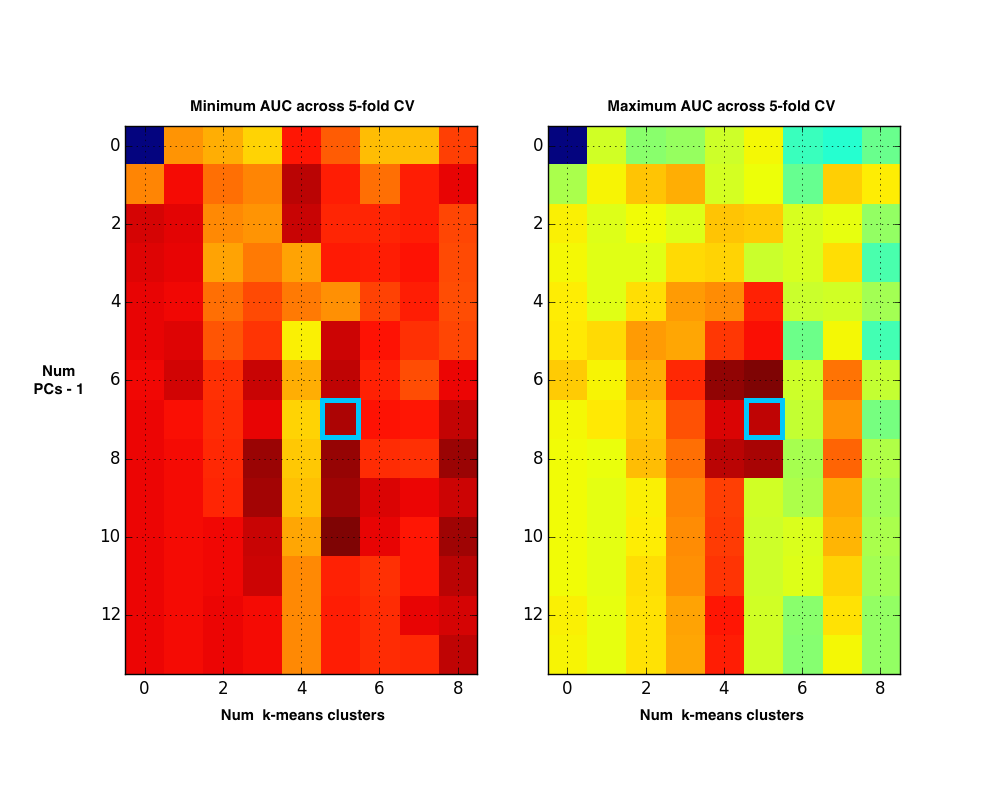

I competed in the [numerai](https://numer.ai/) data modeling challenge as user [Pequod](https://numer.ai/ai?pequod), finishing 59th out of 209 competitors.  Not great, but I'm satisfied with the result given the limited time I put into it.

The model is very simple:

1. PCA dimension reduction from 14 to 8 continuous variables
2. [Dummy code](http://www.psychstat.missouristate.edu/multibook/mlt08m.html) the categorical variable
3. K-means clustering into 6 clusters
4. Separate [ElasicNet CV linear estimators](http://scikit-learn.org/stable/modules/generated/sklearn.linear_model.ElasticNetCV.html) for each cluster.

At one point I was at the head of the leader board, and mainainted the #2 spot until very near the end of the contest.  The competition organizers then made it clear that final rankings would be based on a separate dataset than that used for the leaderboard; at that point, it became very difficult to gauge how well my solution might do, because my results against the validation set often did not line up well with those data set used for leaderboard position.  In other words, my solution was not generalizing very well.

Rather than trying to maintain leaderboard position, I used n-fold cross validation to try and identify the combination of model parameters that produced the highest average AUC score across the CV sets, while minimizing the spread between highest and lowest scoring sets.  I figured this way, I could have more confidence in how my solution would ultimately perform on the final test set.  I chose to use 8 principle components and 6 k-means derived clusters (see cyan highlights in image below)

My final sumbission had AUC 0.53019 on the leaderboard test set.  Even though my highest ranking solution scored AUC of 0.54824, I kept the lower scoring solution posted in the hopes it would generalize well, and that many players above me would be sorely surprised by their ultimate results on the final test set because of overfitting to the leaderboard set.  My solution scored 0.52854 on the final test set - very close to the score on the leaderboard set.

